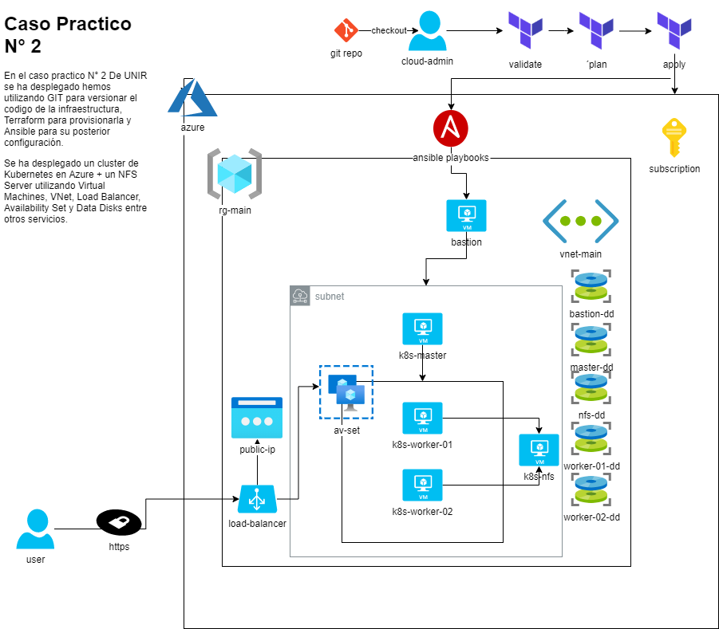
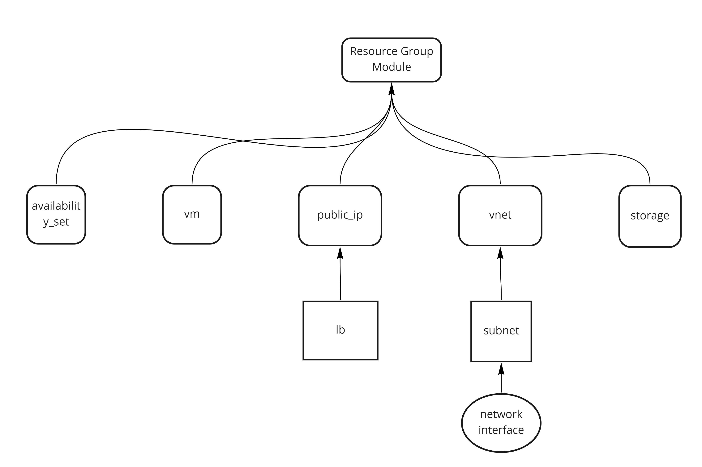

# Caso Practico N° 2 - UNIR

En este repositorio se encontraran los recursos necesarios para desplegar un Cluster de Kubernetes con un servidor NFS.
Los proveedores cloud y tecnologias utilizadas se detallan a continuación
* Cloud Provider: Azure
* Configuration Management: Ansible
* Infrastructure Provisioner: Terraform
* App Deployment: Helm (via Ansible)
* Extras:   
    - az cli
    - powershell/bash

## La infraestructura desplegada se detalla a continuación


 
 -----------------------------------------------------------------
| Role | Sistema Operativo | vCPUs | Memoria (GiB) | Disco Duro |  IP Privada |
|------|-------------------|-------|---------------|------------| ----------- | 
|  master  | CentOS 8.3 |  3.5  |  7  |  1 x 40 GiB (os), 1 x 10 GiB (data) |  192.168.1.10/24  | 
|  worker-01  | CentOS 8.3 |  3.5  |  7  |  1 x 40 GiB (os), 1 x 10 GiB (data)  |  192.168.1.11/24  | 
|  worker-02  | CentOS 8.3 |  3.5  |  7  |  1 x 40 GiB (os), 1 x   10 GiB (data)  | 192.168.1.12/24  | 
|  nfs  |  CentOS 8.3  |  3.5  |  7  |  1 x 40 GiB (os), 1 x 10 GiB (data)  |  192.168.1.13/24  |
|  bastion  |  CentOS 8.3  |  3.5  |  7  |  1 x 40 GiB (os), 1 x 10 GiB (data)  |  192.168.1.14/24  |

## Servicios de Azure Utilizados

* Virtual Machines
* Virtual Network
* Availability Set
* Load Balancer
* Public IP
* Resource Groups
* Data Disk

## Mapa de Dependencias de Terraform

Para desplegar la infraestructura de Terraform hemos utilizado modulos locales a fines de poder reutilizarlos si es necesario. Asi también vamos a utilizar un Azure Blob para guardar el state de terraform.

A continuación se detalla un mapa de dependencia de los modulos creados.


## Requerimientos software
* Ansible 
* terraform 
* azure cli 
    - Subscripcción

## Crear la Infraestructura
Para desplegar la infraestructura y su correspondiente configuración debemos realizar

1.- Inicialmente clonamos el repositorio
```
$ git clone https://github.com/tareafina/UNIR_TP02
```

2.- Una vez instalada y configurada la Azure CLI ejecutamos el script de configuración. 
Agregar en el script de configuracion la Subscript Key correspondiente, luego de la ejecución de este script obtendremos las key y storage account para el paso 3.
Adicionalmente copiamos nuestra pub key para poder acceder a los servidores
```
chmod +rx ./scripts/azure_configuration_script.sh
./scripts/azure_configuration_script.sh
cp $HOME/.ssh/id_rsa.pub ./terraform/modules/vm/keys/id_rsa.pub
cp $HOME/.ssh/id_rsa ./terraform/modules/provision/keys/id_rsa
```

3.- En el archivo provider completamos según corresponda 
```
storage_account_name = ""
subscription_id = ""
client_id       = ""
client_secret   = ""
tenant_id       = ""
    
```

4.- Una vez configurado el provider y el backend procederemos a iniciar Terraform
```
terraform init
```

5.- Luego validaremos la configuración
```
terraform validate
```

6.- Ejecutamos el plan
```
terraform plan
```

7.- Aplicamos los cambios
```
terraform apply
```
De este modo hemos desplegado y configurado via playbooks de ansible la infraestructura para nuestra aplicación.
Luego del Apply obtendremos la Public IP y FQDN Del Bastion y el Load Balancer

De este modo hemos desplegado la infraestructura. Luego del Apply obtendremos la Public IP y FQDN Del Bastión y el Load Balancer via outputs. 
terraform output
```
terraform output
```
8.- Una vez obtenido la public IP del Bastión, deberemos logearnos al mismo y volver a repetir los pasos desde el paso número "1" dado que en los pasos anteriores no se pudo desplegar con el módulo de terraform "Provision" el despliegue de las apps y componentes del cluster de kubernetes. 
